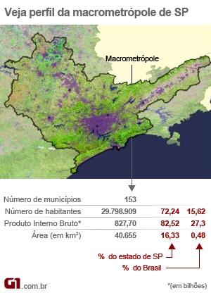
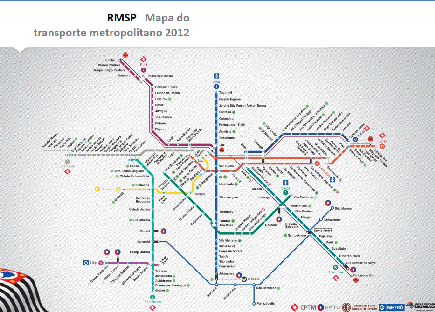
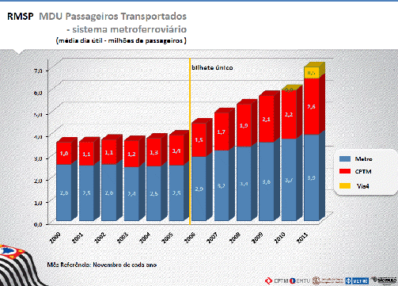

  

**PROJETO DE LEI Nº 295, DE 2012**

  

Autoriza o executivo estadual criar um Sistema de Integração
Metropolitana e entre Metrópoles de Transporte Coletivo Publico para as
Regiões Metropolitanas de São Paulo, de Campinas e do Aglomerado Urbano
de Jundiaí.

  

  

**A ASSEMBLEIA LEGISLATIVA DO ESTADO DE SÃO PAULO DECRETA:**

  

**Artigo 1º -** Fica autorizado ao Executivo Estadual criar um Sistema
de Integração Metropolitana e entre Metrópoles de Transporte Coletivo
Publico para as Regiões Metropolitanas de São Paulo, de Campinas e do
Aglomerado Urbano de Jundiaí conforme parâmetros dispostos nesta Lei.

  

Artigo 2º- Compõe o Sistema de Integração Metropolitana e entre
Metrópoles de Transporte Coletivo Público estabelecendo uma rede de
transportes público os modais disponíveis no âmbito dos municípios, das
Regiões Metropolitanas e do Aglomerado Urbano de Jundiaí.

  

§ 1º- O Sistema abrangerá as linhas operadas por empresas publicas ou
por terceiros, por meio de contratos de concessão ou permissão
existentes com os governos municipais e estadual.

  

§ 2º- Com a finalidade de compor o Sistema Integrado os municípios
poderão firmar convênios com o governo estadual de acordo com a presente
Lei.

  

§ 3º- Consideram-se modais disponíveis operados sobre trilhos as linhas
do Metrô de São Paulo, as linhas da CPTM – Companhia Paulista de Trens
Metropolitanos, e outras que por ventura possam ser implantadas, como os
monotrilhos e Veículos Leves sob Trilhos (VLT) no âmbito metropolitano
ou municipal;

  

§ 4º- Consideram-se modais disponíveis operados sob pneus as linhas
municipais e metropolitanas operadas por ônibus, inclusive as que operam
no Corredor ABD e outras que por ventura possam ser implantadas, como
veículos leves sob pneus (VLP), no âmbito metropolitano ou municipal.

  

  

Artigo 3º- O Sistema proporcionará a ligação entre:

I - os 39 municípios da Região Metropolitana de São Paulo;

II - os 19 municípios da Região Metropolitana de Campinas;

III - os 7 municípios do Aglomerado Urbano de Jundiaí .

  

Artigo 4º- A ligação entre as Regiões Metropolitanas de São Paulo e
Campinas, passando pelo Aglomerado Urbano de Jundiaí, será feita
prioritariamente pelo modal trilho, em linha já existente (Linha 7 –
Rubi da CPTM), ou em outras linhas que venham ser criadas, assegurada
sua completa acessibilidade, modernização e ampliação até o Município de
Campinas.

  

Artigo 5º- Fica autorizada a celebração de convênio com o governo
federal para a operação do Sistema entre o trecho Jundiaí e Campinas.

  

Artigo 6º- O Sistema de Integração Metropolitana e entre Metrópoles de
Transporte Coletivo Publico para as Regiões Metropolitanas de São Paulo,
de Campinas e do Aglomerado Urbano de Jundiaí deverá prever o pagamento
da tarifa com um mesmo cartão ou com cartão compatível, sempre
proporcionando para passageiros integrados a diminuição do valor das
tarifas.

  

Artigo 7º-O Sistema de Integração Metropolitana e entre Metrópoles de
Transporte Coletivo Publico para as Regiões Metropolitanas de São Paulo,
de Campinas e do Aglomerado Urbano de Jundiaí poderá integrar-se com
estacionamentos para veículos particulares no entorno das estações.

  

Artigo 8º-O Sistema deverá contemplar a implantação de bicicletários em
estações e terminais que se tornarão parte integrante e fundamental para
a mobilidade urbana e para sustentabilidade.

  

Artigo 9º-Deverá ser criado a Comissão Metropolitano da Mobilidade
Urbana vinculado aos Conselhos de Desenvolvimento das Regiões
Metropolitanas e do Aglomerado Urbano de Jundiaí.

Parágrafo único. A Comissão deverá ter a participação de representantes
da sociedade civil.

  

Artigo 10-Deverá ser criado um Órgão Gestor composto por representantes
de cada uma das Regiões Metropolitanas e Aglomerado Urbano, com a
presença de representantes dos governos, por meio de seus órgãos
gestores.

Parágrafo único. O Órgão Gestor deverá ter a participação de
representantes da sociedade civil.

  

Artigo 11-O Poder Executivo deverá constituir a Câmara de Compensação
Tarifária, para o controle e revisão dos fluxos de origem e destino,
sendo os mesmos corrigidos constantemente visando à composição dos
repasses e equilíbrio na distribuição dos recursos oriundos para o pleno
funcionamento do Sistema.

§ 1º-A Câmara de Compensação Tarifária deverá ser composta com
representantes dos Órgãos Gestores dos governos estadual e municipais e
das empresas operadoras dos diversos modais do Sistema.

§ 2º- A participação prevista no parágrafo anterior será proporcional
aos passageiros transportados.

  

Artigo 12-As despesas decorrentes da presente lei correrão por conta de
dotações orçamentárias próprias.

Parágrafo único.Os Poderes Estadual e Municipais conveniados deverão
incluir, nos respectivos orçamentos, os valores necessários para o
equilíbrio das políticas de remuneração e tarifária de forma
proporcional.

  

Artigo 13-A presente lei deverá ser regulamentada em 180 (cento e
oitenta ) dias após sua publicação.

  

Artigo 14-Esta lei entra em vigor na data de sua publicação.

  

  

**JUSTIFICATIVA**

  

  

O Estado de São Paulo, pela sua densidade populacional e econômica
configura-se um só território que integra grandes e médias cidades. Essa
integração constitui-se na chamada Macrometrópole. Portanto,
Macrometrópole é o conjunto das [regiões
metropolitanas](http://pt.wikipedia.org/wiki/Região_metropolitana) e
aglomerados urbanos, como é o caso de  São Paulo, de
[Campinas](http://pt.wikipedia.org/wiki/Região_Metropolitana_de_Campinas) e
de Jundiaí.

  

A Macrometrópole se caracteriza, sobretudo pela integração de redes de
cidades que têm áreas de influência que se complementam. É um fenômeno
urbano que tem escala metropolitana ampliada. A Macrometropole
representa 72% da população do estado e está localizada em uma área que
ocupa 16% do território do estado. Isso também traz grandes desafios
como, por exemplo, investimentos em infraestrutura e em outras demandas
importantes como no transporte público.

  

A dinâmica econômica de São Paulo é tão grande que se espraia para
outros territórios, ou de forma complementar ou de forma integrada. A
produção econômica do estado, por exemplo, escoa pelo Porto de Santos.
Toda a carga de exportação por aeroporto da América latina sai por
Viracopos, em Campinas. Os insumos industriais derivados de petróleo são
produzidos em refinarias de Paulínia (Campinas), São José dos Campos
(Vale do Paraíba) e Cubatão (Baixada Santista).

  

Tal fenômeno faz com que as pessoas trabalhem em um lugar e morem em
outro exigindo a circulação de pessoas, bens e serviços dentro de um
mesmo contexto econômico e urbano.

  

  

Nessa dinâmica uma política pública de transporte e trânsito representa
elemento estruturador para uma Mobilidade Urbana de qualidade nas
regiões metropolitanas.

  

Uma política pública que busque a ampliação de experiências positivas
como o Bilhete Único para as regiões Metropolitanas. O Bilhete Único da
forma como vem sendo instituído em diferentes cidades de nosso Estado,
como em São Paulo, Campinas e Guarulhos tem se configurado, sobretudo,
em uma política pública de inclusão social. A criação de um Bilhete
Único Metropolitano que garanta as características de ser um cartão
individual, intransferível e inteligente. O usuário das grandes cidades
tem podido fazer diferentes integrações, ou seja, utilizar diferentes
veículos de transporte coletivo pagando uma só tarifa em um período
estabelecido.

  

Faz-se importante destacar que o conceito adotado pelo Bilhete Único em
São Paulo, Campinas e Guarulhos garante a inclusão social pois à medida
que reduz os custos para o usuário do sistema garante ao usuário uma
economia diária que possibilita ao trabalhador uma redistribuição de sua
renda. (no anexo I uma história que ilustra as dificuldades encontradas
dia-dia pela população:a trajetória de Paulinho).

  

O Bilhete Único se estendido para as regiões Metropolitanos, neste caso
a Região de Campinas, Aglomerado Urbano de Jundiaí e Capital deverá
considerar sua interligação com a rede metroferroviária que atualmente é
composta pela CPTM e METRO dispõe de 335,7 Km e atendem 22 municípios
paulistas, e cerca de 55 mil usuários dia.

  

O Aglomerado Urbano de Jundiaí situa-se em local peculiar, está
circunscrito entre as duas maiores regiões metropolitanas do Estado, a
de São Paulo (recém reformulada pela Lei Complementar nº 1.139/2011) e a
de Campinas. Para demonstrar a grandeza e potencial dessas regiões
metropolitanas e do aglomerado de Jundiaí ressaltamos que são 65
 municípios  que juntos abrigam 12% da população brasileira,
aproximadamente 22 milhões de pessoas.

  

A rede metroferroviária composta pela Companhia Paulista de Trem
Metropolitana - CPTM e METRÔ dispõe de 335,7 Km e atendem 22 municípios
paulistas.

  

O Projeto de Lei apresentado estabelece parâmetros para extensão de 38
Km da Linha 7 (RUBI) da CPTM, de Jundiaí até o Município de Campinas,
interligando os municípios de Louveira, Vinhedo e Valinhos. Indica
também que em Campinas seja construída uma estação na Universidade UNIP
, equacionado um grande problema de mobilidade, também estabelece uma
nova estação junto ao Terminal Intermodal Ramos de Azevedo, que abriga o
Terminal Metropolitano da EMTU.

  

  

A propositura aponta, ainda, para as melhorias da linha 7 RUBI da CPTM,
com reformulação das estações existentes, dotando-as de todos os
equipamentos de modernização, dentre os quais elementos de
acessibilidade para cadeirantes e demais deficiências, com novos pisos,
banheiros, plataformas e comunicação visual.

  

Também indica a adoção de equipamentos com tecnologias mais modernas de
forma a reduzir o tempo de viagem em até 20%, o que poderá resultar em
tempo estimado de duas horas em viagem de São Paulo a Campinas.

  

O PL também faz referência a entendimentos institucionais com o Governo
Federal, especificamente o Departamento Nacional de Infraestrutura de
Transportes - DNIT, para no primeiro momento compartilhar a linha com a
concessionária operadora ALL Logística do trecho entre Jundiaí e
Campinas. As tratativas para implantação do ferroanel, podendo no
segundo momento remanejar os trens de carga no trecho mencionado.

  

A integração é apontada de diversas formas: com bicicletários em
estações e terminais; com estacionamentos no entorno das estações; com
sistemas municipais de ônibus (com adesão e convênio dos respectivos
municípios) e pelo sistema metropolitano gerenciado pela EMTU, incluindo
nestes casos a indicação de recursos para equilíbrio dos sistemas.

  

A proposição aponta para adoção de um único cartão, ou para cartões com
recursos tecnológicos para que os sistemas comuniquem-se como mesmo
bilhete do usuário, sendo este usuário apto a transitar pelos sistemas
municipais conveniados, sistemas Metrô, CPTM e EMTU, adotando os
parâmetros utilizados atualmente com a SPTRANS/METRÔ/CPTM. Tratando
então de uma extensão da linha e dos serviços ora adotados, justamente
para prover de equidade a dinâmica social que os modelos de uso e
ocupação de solo desencadearam nessas regiões metropolitanas.

  

Para o disciplinamento do gerenciamento dos sistemas o PL aponta para
constituição de conselho metropolitano da mobilidade urbana e estendendo
os parâmetros da Lei Complementar 1.139/2011, bem como a criação de
órgão Gestor e Câmara de compensação tarifária. Tais mecanismos de
participação social conferem transparência e modernidade na participação
da sociedade civil organizada, tão importante para a manutenção do
regime democrático.

  

Por fim, esta medida está em consonância com o espírito criativo, ousado
mas necessário para tornar-se em alternativa para os crescentes
problemas de baixa mobilidade de nossas cidades, constitui aí fonte de
redução de custos diretos a população, redução de poluentes lançados á
atmosfera e principalmente conferindo racionalização dos sistemas
aumentando a qualidade de vida de cerca de 22 milhões de habitantes.

  

Neste sentido, contamos com a participação dos nobres pares na
apreciação deste Projeto de Lei.

  

  

  
  

**Anexo 1: Exemplo da proposta**

  

  

**A Trajetória de Paulinho**

  

Paulo cidadão, morador da Região Metropolitana de Campinas, na Cidade de
Hortolândia, no Estado de São Paulo. Paulo é trabalhador da construção
civil, um jovem sonhador, alegre e otimista que faz planos para o futuro
e busca melhorar a vida de sua família, acredita que somente por meio do
meio do trabalho e do estudo poderá alcançar seus ideais. Atualmente
trabalha em Campinas e faz curso de Tecnologia em Logística e Transporte
na FATEC de Jundiaí onde conheceu sua namorada Anita que mora em São
Miguel Paulista, zona leste da Cidade de São Paulo.

Diariamente Paulinho sai de Hortolândia vai para Campinas e a segue à
tardinha para Jundiaí fazendo o retorno no mesmo trajeto.

  

Para tanto:

Acorda às 5h, toma seu café e vai a pé até o ponto onde pega ônibus
metropolitano de Hortolândia para Campinas.

  

\* Chega a Campinas às 7h e trabalha até às 17h.

\* Pega ônibus no Terminal Multimodal Ramos de Azevedo com destino à
Jundiaí às 17h30

\* Chega às 19h na FATEC e estuda até às 23h, porém sai 10 minutos antes
do término da aula, pois não pode perder o ônibus para Campinas, pois
ainda terá que pegar um ônibus metropolitano até sua casa em
Hortolândia.

\* Pega ônibus de Jundiaí para Campinas, sendo que chega em cima da hora
e não pode perder o último ônibus de Campinas as 11 h 55 min até seu
bairro em Hortolândia.

\* Chega em casa a 0h40min.

\* Sua namorada mora em São Miguel Paulista, zona leste. Estuda na mesma
Faculdade, eles mal se veem durante a semana, pois estudam em cursos
diferentes, ela faz Tecnologia em Construção Civil, assim namoro de
verdade somente aos finais de semana, isto quanto não estão em período
de provas, pois como Paulinho sofre com uma tontura terrível , não
consegue estudar em seus demorados trajetos no transporte. Assim nos
finais de semana ele se desloca até a casa dela, eta! viagem demorada...

Um dia cansado Paulinho, antes de dormir faz as contas dos gastos e
tempo que está tendo com sua rotina de trabalho e estudo, fica apavorado
pois só em passagem gasta muito além de que recebe em vale-transporte,
pois se de fato computasse seus reais gastos com transporte, certamente
não teria conseguido ser admitido em seu trabalho. Desta forma seu
gastos extras no ônibus Metropolitano de Hortolândia e o ônibus
Rodoviário para Jundiaí, representam mais da metade de seu salário
líquido, isto ainda por que anda a pé um bom pedaço entre o ponto de
ônibus e sua casa. Paulinho adormece, durante o sono sonho com outra
realidade:

  

\* Sonha que seu trajeto se tornou muito mais seguro, rápido e barato ,
ao chegar no ponto de ônibus compra o BUM (Bilhete Único Metropolitano)
e com apenas uma passagem de R\$ 3,10 chega a seu trabalho em 40min,
pois o Corredor Noroeste da EMTU finalmente estava concluído e completo.

\* Percebe que o percurso foi mais rápido pois em Campinas havia em
todas as avenidas corredores de ônibus, tudo interligado pelo BUM.

\* Depois do dia de trabalho vai para o Terminal Multimodal Ramos de
Azevedo (Nova Rodoviária) onde integra com a mesma tarifa na Linha 7
RUBI da CPTM (agora até Campinas), confortável, moderno, limpo, com
amplas portas, silencioso e segue para Jundiaí em pouco menos de 35
minutos.(com novos trem da serie 7000 e 7500).

\* Encontra seu Amigo Roger, que embarca em Valinhos, Vanessa em Vinhedo
e ainda se despede de seu colega de trabalho Gumercindo que mora em
Louveira. Vanessa e Roger pertencem ao mesmo grupo na Faculdade, assim,
conversam sobre temas da atualidade e ainda revisam uma apresentação que
teriam que apresentar na semana seguinte.

\* Chega às 18h na Faculdade e agora pode encontrar sua namorada e até
conseguem jantar juntos a tempo de irem às suas aulas (19h).

\* Estuda até às 23h, sem ter que sair mais cedo.

\* E, consegue chegar em Hortolândia à meia noite e meia, sem o medo de
perder o último ônibus

\* Nos finais de semana podia agora fazer o mesmo trajeto completo e
transferir gratuitamente para outras linhas da CPTM e do Metro e em São
Paulo ainda utiliza ônibus da SPTRANS, com apenas uma complementação na
tarifa de mais R\$1,60, assim consegue chegar em São Paulo na casa de
sua namorada por cerca de R\$ 4,70 sendo que em pois lá assim como em
Campinas, o Bilhete Único já era utilizado por muitos anos.

  

Porém ao acordar, dá-se conta que é um sonho e volta para realidade,
porém fica com essa idéia na cabeça:

  

Naquela mesma semana ao descer no terminal metropolitano de Campinas.
Observa um cidadão que distribuía material e pedia assinaturas para
implantar o Bilhete Único Metropolitano e da extensão da CPTM até
Campinas, assina o tal documento e começa a pensar que existe
possibilidades concretas de seu sonho tornar-se realidade.

  

Naquele dia em seu horário de almoço vai a uma ‘lan house”e ao acessar a
Internet, procura por mais informações e lá encontra a “Frente
Parlamentar em Defesa do Bilhete Único Metropolitano.” E também descobre
que o Bilhete Único existe em outras Cidades e pode fazer ser um meio
para transformar sua realidade.

  

A partir desse dia despertou a consciência que para mudar a realidade ,
precisamos de bons projetos e não apenas sonhos, e mais que de maneira
organizada a sociedade pode avançar em sua prática democrática, assim
entendeu que d**esenvolvimento sustentável** precisa de ações
**ambientalmente equilibradas**, como por exemplo com a volta do trem
elétrico, menos poluente e com economia de energia dispensada; de ações
**socialmente justas**, como por exemplo integração tarifária econômica
e de qualidade, diminuindo as barreiras entre as pessoas, pondo fim a
segregação sócio espacial e ainda pelo viés **economicamente
includente**, propiciando que à toda população da Grande São Paulo, da
Região Metropolitana de Campinas e do Novo aglomerado Urbano de Jundiaí,
tenham as mesmas condições de acesso ao trabalho e estudo e por isto
Paulinho, junto com sua namorada Anita , os Amigos Roger e Vanessa
passaram a defender e reivindicar o BUM (Bilhete Único Metropolitano) e
do Trem da Linha 7 (RUBI) da CPTM até Campinas ( Campinas-Estação da Luz
em São Paulo).

  

  
  

  
  

  
  

  
  

  
  

  
  

  
  

  
  

  
  

**Anexo 2**- A Macrometrópole

  
  

  
  

  
  

  
  

  
  

  
  

  
  

  
  

  
  

  
  

  
  

**Anexo 3 -** a Rede de Transporte RMSP

  
  

  
  

  
  

  
  

  
  

  
  

  
  

  
  

  
  

  
  

  
  

  
  

  
  

  
  

  
  

**Anexo 4**: Passageiros Transportados Diariamente CPTM/METRO

  

  

  

  

Sala das Sessões, em 27/4/2012

  

  

  

  

  

1.  **Gerson Bittencourt - PT**

  

